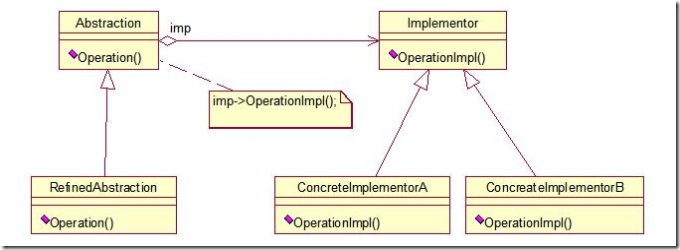
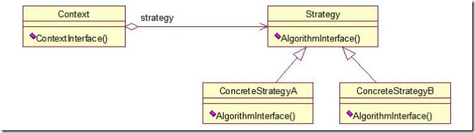

##桥模式
### 定义
* 桥模式就是把抽象部分和它的实现部分分离开来，让两者可独立变化。这里的抽象部分指的是一个概念层次上的东西，它的实现部分指的是实现这个东西的（功能）部分，分离就把实现部分从它要实现的抽象部分独立出来，自我封装成对象。

###类图：


###组成：
* 抽象化(Abstraction)角色：抽象化给出的定义，并保存一个对实现化对象的引用。
* 修正抽象化(Refined Abstraction)角色：扩展抽象化角色，改变和修正父类对抽象化的定义。
* 实现化(Implementor)角色：这个角色给出实现化角色的接口，但不给出具体的实现。必须指出的是，这个接口不一定和抽象化角色的接口定义相同，实际上，这两个接口可以非常不一样。
* 具体实现化(Concrete Implementor)角色：这个角色给出实现接口的具体实现。

实例：动物行为的例子，我们把行为从动物类中抽离出来，形成行为类，在动物类中引用这个行为对象，这样动物的行为可以独立变化。
```
public abstract class MovementImplementor
{
    public abstract void move();
}

public class FlyConcreteImplementor extends MovementImplementor
{
    @Override
    public void move()
    {
        System.out.println(" Fly!!! ");
    }
}

public class JumpConcreteImplement extends MovementImplementor
{
    @Override
    public void move()
    {
        System.out.println(" jump!!!");
    }
}

public class Abstraction
{
    protected final MovementImplementor implementor;

    public Abstraction(final MovementImplementor implementor)
    {
        this.implementor = implementor;
    }

    public void move()
    {
        this.implementor.move();
    }
}

public class ChickRefinedAbstraction extends Abstraction
{
    public ChickRefinedAbstraction(final MovementImplementor implementor)
    {
        super(implementor);
    }

    @Override
    public void move()
    {
        System.out.print("chicks");
        super.move();
    }
}

public class DogRefinedAbstraction extends Abstraction
{
    public DogRefinedAbstraction(final MovementImplementor implementor)
    {
        super(implementor);
    }

    @Override
    public void move()
    {
        System.out.print("dogs");
        super.move();
    }
}

public class Client
{
    public static void main(final String[] args)
    {
        final MovementImplementor fly = new FlyConcreteImplementor();
        final MovementImplementor jump = new JumpConcreteImplement();

        final Abstraction chick = new ChickRefinedAbstraction(fly);
        final Abstraction dog = new DogRefinedAbstraction(jump);

        chick.move();
        dog.move();
    }
}
```
结果：
* chicks Fly!!! 
* dogs jump!!!

### 桥接模式与策略模式之间的区别
> * 学习的过程中发现这两个概念真的是有点区分不开，尽管可以很感性的说bridge模式要比strategy模式更复杂更具可塑性，更“高级”，但是如何清晰阐述两者区别，却实是有点困难。
> * 套用伟人的一句话，站在巨人的肩膀上看得更远，下边三段分别来自CSDN论坛的贴子和一篇blogjava的文章，看了之后令我茅塞顿开，为表尊重不在冗述，直接贴原文了。
> * 实际上所有模式可以只分为类模式和对象模式两种，类模式是用继承而对象模式是用委托Bridge模式和Strategy模式相似就是因为他们都将任务委托给了另外一个接口的具体实现，他们之间的区别在于Bridge的目的是让底层实现和上层接口可以分别演化，从而提高移植性而Strategy的目的是将复杂的算法封装起来，从而便于替换不同的算法。因此可以想象一般情况下Bridge的实现几乎不会在运行时更改而Strategy的算法则很有可能需要在运行时更换，这就导致在细节方面需要考虑的因素可能会很不相同。
> * strategy模式是为了扩展和修改，并提供动态配置。它往往可以在同一环境当中使用不同的策略，就是调用不同的派生类。其内部实现是自由的，不受已有的类接口的限制（很多时候根本就不调用现成的接口）。bridge模式是往往是为了利用已有的方法或类。它将原来不统一，不兼容的接口封装起来，变成统一的接口。它的应用往往是不同的环境或平台下只能选择一 种，比如说在windows平台下只能用WinClass,而在unix平台下只能用UnixClass.它的主要作用不是配置而是定义通用接口。
> * 据个例子来说：我要画园，要实心园，我可以用SolidPen来配置，画虚线园可以用dashedPen来配置。这是strategy模式。而同样是画园，我是在windows下来画实心园，就用windowPen+solidPen来配置，在unix下画实心园就用 unixPen+solidPen来配置。如果要再windows下画虚线园，就用windowsPen+dashedPen来配置，要在unix下画虚 线园，就用unixPen+dashedPen来配置。
> * 我这里仅仅是就一种情况来说strategy和bridge的组合应用，其他的组合可能性随环境变化而多种多样。从中可以看出，bridge和strategy是可能组合使用，侧重不同方面的。模式某种角度上来讲就是对象组合。不要看他们都是对象组合就好像是一样的。模式的动机，意图，使用场合，组合方式，这些都是模式的一部分。其中细微的不同足以区分不同的模式。
> * 桥接(Bridge)模式是结构型模式的一种，而策略(strategy)模式则属于行为模式。以下是它们的UML结构图。
> * 在桥接模式中，Abstraction通过聚合的方式引用Implementor。

> * 在策略模式中，Context也使用聚合的方式引用Startegy抽象接口。

> * 从他们的结构图可知，在这两种模式中，都存在一个对象使用聚合的方式引用另一个对象的抽象接口的情况，而且该抽象接口的实现可以有多种并且可以替换。可以说两者在表象上都是调用者与被调用者之间的解耦，以及抽象接口与实现的分离。
> * 那么两者的区别体现在什么地方呢？
> * 1、 首先，在形式上，两者还是有一定区别的，对比两幅结构图，我们可以发现，在桥接模式中不仅Implementor具有变化 （ConcreateImplementior），而且Abstraction也可以发生变化（RefinedAbstraction），而且两者的变化 是完全独立的，RefinedAbstraction与ConcreateImplementior之间松散耦合，它们仅仅通过Abstraction与 Implementor之间的关系联系起来。而在策略模式中，并不考虑Context的变化，只有算法的可替代性。
> * 2、其次在语意上，桥接模式强调Implementor接口仅提供基本操作，而Abstraction则基于这些基本操作定义更高层次的操作。而策略模式强调 Strategy抽象接口的提供的是一种算法，一般是无状态、无数据的，而Context则简单调用这些算法完成其操作。
> * 3、桥接模式中不仅定义Implementor的接口而且定义Abstraction的接口，Abstraction的接口不仅仅是为了与 Implementor通信而存在的，这也反映了结构型模式的特点：通过继承、聚合的方式组合类和对象以形成更大的结构。在策略模式中，Startegy 和Context的接口都是两者之间的协作接口，并不涉及到其它的功能接口，所以它是行为模式的一种。行为模式的主要特点就是处理的是对象之间的通信方 式，往往是通过引入中介者对象将通信双方解耦，在这里实际上就是将Context与实际的算法提供者解耦。
> * 所以相对策略模式，桥接模式要表达的内容要更多，结构也更加复杂。桥接模式表达的主要意义其实是接口隔离的原则，即把本质上并不内聚的两种体系区别 开来，使得它们可以松散的组合，而策略在解耦上还仅仅是某一个算法的层次，没有到体系这一层次。从结构图中可以看到，策略的结构是包容在桥接结构中的，桥 接中必然存在着策略模式，Abstraction与Implementor之间就可以认为是策略模式，但是桥接模式一般Implementor将提供一系 列的成体系的操作，而且Implementor是具有状态和数据的静态结构。而且桥接模式Abstraction也可以独立变化。