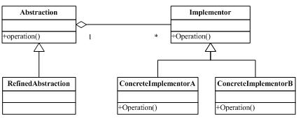

##桥模式
### 定义
* 桥模式就是把抽象部分和它的实现部分分离开来，让两者可独立变化。这里的抽象部分指的是一个概念层次上的东西，它的实现部分指的是实现这个东西的（功能）部分，分离就把实现部分从它要实现的抽象部分独立出来，自我封装成对象。

###类图：



###组成：
* 抽象化(Abstraction)角色：抽象化给出的定义，并保存一个对实现化对象的引用。
* 修正抽象化(Refined Abstraction)角色：扩展抽象化角色，改变和修正父类对抽象化的定义。
* 实现化(Implementor)角色：这个角色给出实现化角色的接口，但不给出具体的实现。必须指出的是，这个接口不一定和抽象化角色的接口定义相同，实际上，这两个接口可以非常不一样。
* 具体实现化(Concrete Implementor)角色：这个角色给出实现接口的具体实现。

实例：动物行为的例子，我们把行为从动物类中抽离出来，形成行为类，在动物类中引用这个行为对象，这样动物的行为可以独立变化。
```
public abstract class MovementImplementor
{
    public abstract void move();
}

public class FlyConcreteImplementor extends MovementImplementor
{
    @Override
    public void move()
    {
        System.out.println(" Fly!!! ");
    }
}

public class JumpConcreteImplement extends MovementImplementor
{
    @Override
    public void move()
    {
        System.out.println(" jump!!!");
    }
}

public class Abstraction
{
    protected final MovementImplementor implementor;

    public Abstraction(final MovementImplementor implementor)
    {
        this.implementor = implementor;
    }

    public void move()
    {
        this.implementor.move();
    }
}

public class ChickRefinedAbstraction extends Abstraction
{
    public ChickRefinedAbstraction(final MovementImplementor implementor)
    {
        super(implementor);
    }

    @Override
    public void move()
    {
        System.out.print("chicks");
        super.move();
    }
}

public class DogRefinedAbstraction extends Abstraction
{
    public DogRefinedAbstraction(final MovementImplementor implementor)
    {
        super(implementor);
    }

    @Override
    public void move()
    {
        System.out.print("dogs");
        super.move();
    }
}

public class Client
{
    public static void main(final String[] args)
    {
        final MovementImplementor fly = new FlyConcreteImplementor();
        final MovementImplementor jump = new JumpConcreteImplement();

        final Abstraction chick = new ChickRefinedAbstraction(fly);
        final Abstraction dog = new DogRefinedAbstraction(jump);

        chick.move();
        dog.move();
    }
}
```
结果：
* chicks Fly!!! 
* dogs jump!!!