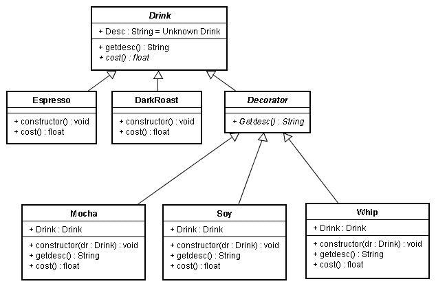

装饰模式是在不必改变原类文件和使用继承的情况下，动态的扩展一个对象的功能。它是通过创建一个包装对象，也就是装饰来包裹真实的对象。

装饰模式的特点：
1) 装饰对象和真实对象有相同的接口，这样客户端对象就可以和真实对象相同的方式和装饰对象交互。
2）装饰对象包含一个真实对象的引用。
3）装饰对象接受所有来自客户端的请求，它把这些请求转发给真实的对象。
4）装饰对象可以在转发这些请求以前或以后增加一些附加功能。这样就确保了在运行时，不用修改给定对象的结构就可以在外部增加附加的功能。在面向对象的设计中，通常是通过继承来实现对给定类的功能扩展。

类图：

实例：
public abstract class Drink
{
    protected String desc;

    public String getDesc()
    {
        return this.desc;
    }

    public abstract float cost();
}

public class Espresso extends Drink
{
    public Espresso()
    {
        this.desc = "in Espresso,";
    }

    @Override
    public float cost()
    {
        return 100;
    }
}

public class DartRoast extends Drink
{
    public DartRoast()
    {
        this.desc = "in DartRoast,";
    }

    @Override
    public float cost()
    {
        return 50;
    }
}

public abstract class Decorator extends Drink
{
    protected final Drink drink;

    public Decorator(final Drink drink)
    {
        this.drink = drink;
    }

    @Override
    public abstract float cost();
}

public class Mocha extends Decorator
{
    public Mocha(final Drink drink)
    {
        super(drink);
        this.desc = " add Mocha ";
    }

    @Override
    public String getDesc()
    {
        return this.drink.getDesc() + this.desc;
    }

    @Override
    public float cost()
    {
        return this.drink.cost() + 10;
    }
}

public class Soy extends Decorator
{
    public Soy(final Drink drink)
    {
        super(drink);
        this.desc = " add Soy ";
    }

    @Override
    public String getDesc()
    {
        return this.drink.getDesc() + this.desc;
    }

    @Override
    public float cost()
    {
        return this.drink.cost() + 5;
    }
}

public class Whip extends Decorator
{
    public Whip(final Drink drink)
    {
        super(drink);
        this.desc = " add Whip ";
    }

    @Override
    public String getDesc()
    {
        return this.drink.getDesc() + this.desc;
    }

    @Override
    public float cost()
    {
        return this.drink.cost() + 15;
    }
}

public class Client
{
    public static void main(final String[] args)
    {
        final Drink dartRoastDrink = new DartRoast();
        final Drink espressoDrink = new Espresso();

        final Drink Mocha = new Mocha(dartRoastDrink);
        final Drink soy = new Soy(Mocha);
        System.out.println(soy.getDesc() + soy.cost());

        final Drink whip = new Whip(espressoDrink);
        System.out.println(whip.getDesc() + whip.cost());
    }
}

结果：
in DartRoast, add Mocha  add Soy 65.0
in Espresso, add Whip 115.0

优点：
1）Decorator模式与继承关系的目的都是扩展对象功能，但是Decorator可以提供比继承更多的灵活性。
2）通过使用不同的具体装饰类以及这些装饰类的排列组合，设计师可以创造出很多不同行为的组合。

缺点：
1）这种比继承更加灵活机动的特性，也同时意味着更加多的复杂性。
2）装饰模式是针对抽象组件(Component)类型编程。但是，如果你要针对具体组件编程时，就应该重新思考你的应用架构，以及装饰者是否适合。当然也可以改变Component接口，增加新的公开的行为，实现"半透明"的装饰者模式。在实际项目中要做出最佳选择。

在java类库中的IO流就是用装饰者模式设计的。