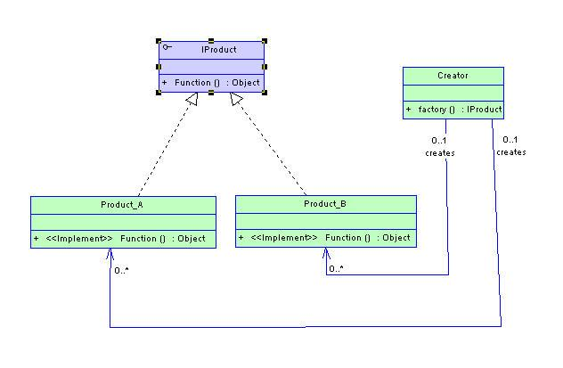
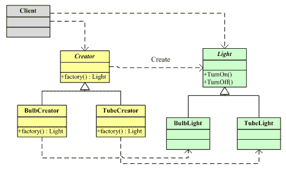

工厂模式提供创建对象的接口。
工厂模式分为三类：简单工厂模式(Simple Factory), 工厂方法模式(Factory Method)和抽象工厂模式(Abstract Factory).
GOF在《设计模式〉中将工厂模式分为两类：工厂方法模式(Factory Method)和抽象工厂模式(Abstract Factory)。

1. 简单工厂模式(Simple Factory)
简单工厂模式又叫做静态工厂方法模式。简单工厂模式的实质是由一个工厂类根据传入的参数，动态决定应该创建哪一个产品类（这些产品类继承自一个父类或接口）的实例。
该模式中包含的角色及职责：
工厂（Creator)角色：它是简单工厂模式的核心，负责实现创建所有实例的内部逻辑。工厂类可以被外界直接调用，创建所需要的产品对象。
抽象产品角色：它负责描述所有实例所共有的公共接口。
具体产品角色：是简单工厂模式的创建目标，所有创建的对象都是充当这个角色的某个具体类的实例。

缺点：在工厂类中集中了所有实例的创建逻辑，违反了高内聚责任分配原则，将全部创建逻辑集中到了一个工厂类中；对系统的维护和扩展不利；

使用场景：负责创建的对象比较少；客户只知道传入工厂类的参数，对于如何创建对象的逻辑不关心；容易违反高内聚责任分配原则，所以只在很简单的情况下应用；

类图:
 
实例：
//抽象产品角色
public interface IProduct
{
    public void saleProduct();
}
//具体产品角色
public class Product_A implements IProduct
{
    @Override
    public void saleProduct(){
        ...        
    }

}
//具体产品角色
public class Product_B implements IProduct
{
    @Override
    public void saleProduct(){
        ...        
    }

}
//工厂角色
public class Creator
{
    public IProduct createProduct(int productFlag){
        switch(productFlag){
            case 1:
                return new Product_A();
            case 2:
                return new Product_B();
            default:
                return null; 
        }
    }
}

2. 工厂方法模式（Factory Method)
工厂方法模式是简单工厂方法模式的衍生，它的核心工厂类不再负责产品的创建，这样核心类成为一个抽象工厂角色，仅负责具体工厂子类必须实现的接口，使得系统可以在不修改具体工厂角色的情况下引用新的产品。
在这个模式中，一个抽象工厂对应一个抽象产品，一个具体工厂对应一个具体产品。
工厂方法模式是最典型的模板方法模式（Template Method Pattern)应用。

 

该模式中包含的角色及职责： 
 

抽象工厂（Creator)角色：工厂方法模式的核心，任何在模式中创建的对象的工厂必须实现这个接口。
具体工厂（Concrete Creator)角色：实现抽象工厂接口的具体工厂类，包含应用程序的逻辑。
抽象产品（Product)角色：产品对象的共同父类或共同拥有的接口。
具体产品（Concrete Product)角色：实现了抽象产品角色定义的接口，其具体产品有专门的具体工厂创建。

使用场景：
对于某个产品，调用者清楚知道应该使用哪个具体工厂服务，实例化该具体工厂，生产出具体的产品来；
只是需要一种产品，对于那个工厂生产的并不关心，最终选用哪个具体工厂由生产者一方决定，它根据当前系统的情况来实例化一个具体的工厂返回给使用者，这个决策过程对于使用者来说是透明的。

类图: 

实例：
//抽象工厂
public interface Creator{
       public Light factory();
}
//抽象产品
public interface Light{
    public void TurnOn();
    public void TrunOff();
}
//具体产品
public class BullbLight implements Light{
    public void TurnOn(){
    }

    public void TrunOff(){
    }
}
//具体产品
public class TubeLight implements Light{
    public void TurnOn(){
    }

    public void TrunOff(){
    }
}
//具体工厂
public class BullbCreator implements Creator{
       public Light factory(){
        return new BullbLight();
    }
}
//具体工厂
public class TubeCreator implements Creator{
       public Light factory(){
        return new TubeLight();
    }
}
public class Client{
       public static void main(String[] args){
              Creator create = new BullbCreator();
          Light bullbLight = create.factory();
          bullbLight.TurnOn();

              Creator create1 = new TubeCreator();
          Light tubebLight = create.factory();
          tubebLight.TurnOn();

       }
}

3. 抽象工厂模式（Abstract Factory)
抽象工厂模式是指当有多个抽象角色时，使用的一种工厂模式。抽象工厂模式可以向客户端提供一个接口，使客户端在不必指定产品的具体情况下，创建多个产品族中的产品对象。

类图: 
 

实例：
//抽象工厂角色
public interface AbstractFactory{
　　public ProductA createProductA();
　　public ProductB createProductB();
}

//抽象产品类A
public interface AbstractProductA
{
}

//抽象产品类B
public interface AbstractProductB
{
}

//具体产品类ProdcutA1
public class ProductA1 implements AbstractProductA 
{
　　public ProductA1()
　　{
　　}
}

//具体产品类ProdcutA2
public class ProductA2 implements AbstractProductA
{
　　public ProductA2()
　　{
　　}
}

//具体产品类ProductB1
public class ProductB1 implements AbstractProductB
{
　　public ProductB1()
　　{
　　}
} 

//具体产品类ProductB2
public class ProductB2 implements AbstractProductB
{
　　public ProductB2()
　　{
　　}
}

//具体工厂类1
public class ConcreteFactory1 implements AbstractFactory{
　　public AbstractProductA createProductA(){
　　return new ProductA1();
　　}
　　public AbstractProductB createProductB(){
　　return new ProductB1();
    }
}

//具体工厂类2
public class ConcreteFactory2 implements Creator{
　　public AbstractProductA createProductA(){
　　return new ProductA2();
　　}
　　public AbstractProductB createProductB(){
　　return new ProductB2();
　　}
} 