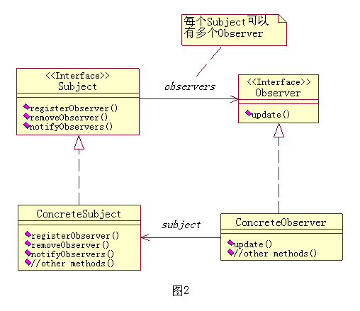

# 观察者模式
## 观察者模式定义
* 观察者模式定义了对象间的一种一对多依赖关系，使得每当一个对象改变状态，则所有依赖于它的对象都会得到通知并被自动更新。
* 它将观察者和被观察者的对象分离开。提高了应用程序的可维护性和重用性。
* 实现观察者模式有很多形式，一种是“注册---通知---撤销注册”的形式。
* 观察者Observer：所有潜在的观察者必须实现观察者接口，这个接口只有update方法，当主题改变时，它被调用。
* 具体观察者ConcreteObserver: 具体观察者可以是任何实现了Observer接口的类。观察者必须注册具体主题，一边接收更新。
* 可观察者Subject: 主题接口，即可观察者Observable，对象使用此接口注册为观察者，或者把自己从观察者中删除，每个主题可以有多个观察者。
* 具体可观察者ConcreteSubject: 一个具体主题实现了主题接口，除了注册和撤销之外，具体主题还实现了notifyObservers()方法，这个方法用来在主题状态改变时更新所有观察者。具体主题也可能有设置和获取状态的方法。
## 类图

## 观察者模式的应用场景：
* 1、 对一个对象状态的更新，需要其他对象同步更新，而且其他对象的数量动态可变。
* 2、 对象仅需要将自己的更新通知给其他对象而不需要知道其他对象的细节。
## 观察者模式的优点：
* 1、 Subject和Observer之间是松偶合的，分别可以各自独立改变。
* 2、 Subject在发送广播通知的时候，无须指定具体的Observer，Observer可以自己决定是否要订阅Subject的通知。
* 3、 遵守大部分GRASP原则和常用设计原则，高内聚、低偶合。
## 观察者模式的缺陷：
* 1、 松偶合导致代码关系不明显，有时可能难以理解。(废话)
* 2、 如果一个Subject被大量Observer订阅的话，在广播通知的时候可能会有效率问题。（毕竟只是简单的遍历）